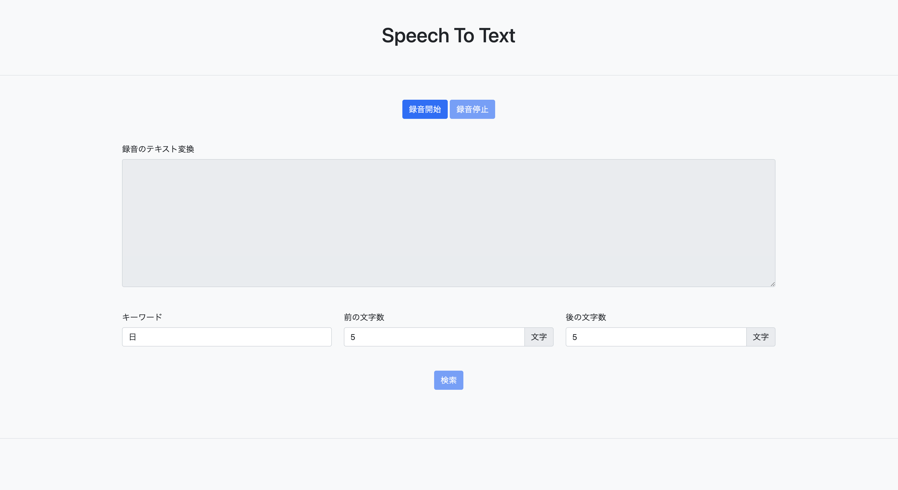

# 音声認識APIデモ



## ファイル構成

```zsh
.
├── README.md
├── app
│   ├── apiKey.js
│   ├── extractionKeyword.js .. キーワード検索モジュール
│   ├── favicon.ico
│   ├── index.html
│   ├── main.js .. 画面制御
│   ├── recorder.js .. 録音ライブラリ
│   └── style.css
├── babel.config.js .. JestでES6記法のテストを使用する際に必要な設定ファイル
├── jest.config.js .. Jestの設定ファイル
├── package.json
├── test
│   └── extractionKeyword.test.js .. 単体テストコード
└── thumbnail.png
```

## 画面確認

### 実行環境

Node.js(15.x)

### 前提

GCPでCloud Speech-to-textのAPI利用を許可しておくこと

### 対応ブラウザ

Chrome

### 画面確認の準備

- ./app/apiKey.jsにAPIKEYを平文で記入

- ./srcで`npm i`を実行し、プラグインをダウンロード

### 画面確認の方法

- ./srcで`npm start`を実行
- ブラウザが立ち上がります
  - localhostの5000ポートが使用されていると失敗します。package.jsonのscripts、`start`のポートを変更してください
- マイク使用許可のダイアログが表示されるので「許可」を選択
  - ダイアログが表示されない場合、検索バーの「i」をクリック
  - マイクのプルダウンで「許可」を選択

## 画面の使い方

1. 録音開始ボタンをクリックして話しかけます
2. 話終えると録音停止ボタンをクリックして録音を終了します
3. 暫くすると「録音のテキスト変換」に話した内容が表示されます
4. 「キーワード」「前に含める文字数」「後ろに含める文字数」を入力し検索ボタンをクリックします
5. 一致するキーワードがあれば、検索ボタンの下に表示されます

## 機能説明

### 録音開始ボタン

- 録音を開始します

### 録画停止ボタン

- 録音を停止します。音声データを解析し、画面上に出力します

### 録音のテキスト変換

- 録音データのテキスト変換出力先

### キーワード

- 録音データ(テキスト)に対して、検索したい単語を入力します

### 前の文字数

- キーワードの前に含めたい文字数を入力します

### 後の文字数

- キーワードの後ろに含めたい文字数を入力します

### 検索ボタン

- 検索条件で録音データ(テキスト)を検索し、画面上に結果を出力します。録音データ(テキスト)が出力されるまでクリックできません

### バリデーションチェック

- 検索条件が一つでも未入力のものがあると、検索ボタン押下時にエラー出力されます


## 単体テスト

[Jest](https://jestjs.io/ja/)を使用した単体テストを行えます。./srcで`npm test`を実行するとテストが実行されます。

